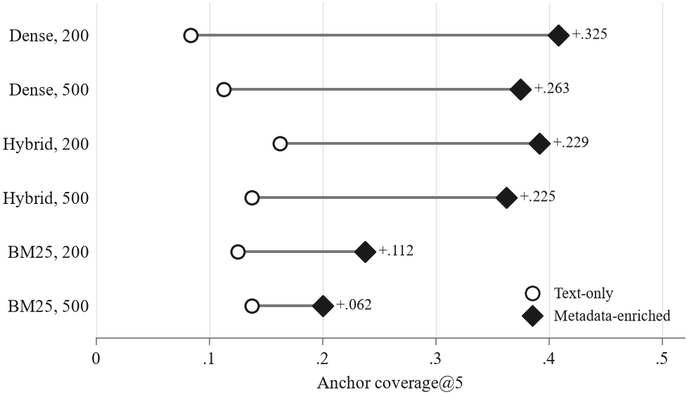
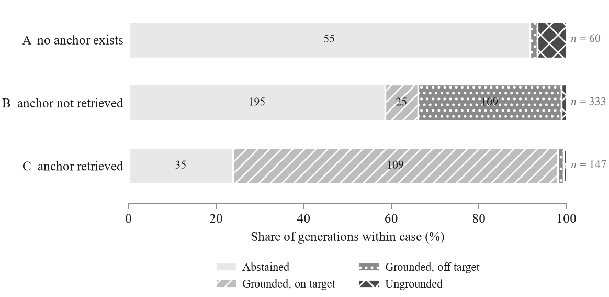

# Retrieval design and answer quality in RAG over earnings call transcripts

Code, data and results for the bachelor thesis *How Retrieval Design Affects
Answer Quality in RAG-Based Question Answering over Earnings Call Transcripts*
(Kamila Bekkozhina, TUM, Management & Technology).

A retrieval-augmented system can answer only from what its retriever finds.
Earnings calls are hard for this: the same banks discuss the same topics in
near-identical language every quarter, so the difficulty is finding the right
passage rather than a similar wrong one. This repository is a controlled
experiment that varies three retrieval-design choices and holds everything else
fixed.

## Findings

- **Chunk size made no detectable difference, and neither did retrieval strategy
  on raw text.** What separates these documents is the company and the quarter,
  and that information never reached the text the retrievers searched.
- **Indexing the company and quarter with each chunk moved retrieval
  substantially** — for dense and hybrid retrieval at both chunk sizes; for BM25
  only at 200 tokens and only on the rank metric. It also lost some questions
  that raw-text indexing had found.
- **Better retrieval did not reach the answers.** No difference in answer
  outcomes between conditions was detectable at this sample size.
- **The automatic grounding check errs in a predictable direction.** All 9
  answers it called ungrounded were read by hand; 4 were faithful text the
  verbatim check could not recognize.
- **Correct abstention is a target, not a failure.** When the retrieved context
  cannot support an answer, the generator declining to answer is the right
  outcome, and an evaluation should score it so.



| chunk size | strategy | coverage@5 text-only | coverage@5 enriched | MRR@5 text-only | MRR@5 enriched |
|--:|---|--:|--:|--:|--:|
| 200 | dense  | 0.083 | 0.408 | 0.043 | 0.241 |
| 200 | BM25   | 0.125 | 0.237 | 0.064 | 0.153 |
| 200 | hybrid | 0.163 | 0.392 | 0.090 | 0.290 |
| 500 | dense  | 0.113 | 0.375 | 0.073 | 0.290 |
| 500 | BM25   | 0.138 | 0.200 | 0.074 | 0.077 |
| 500 | hybrid | 0.138 | 0.362 | 0.109 | 0.260 |

Generation outcomes of the reported generator, all 540 records, by whether a
gold anchor was retrieved:



## Design

**Corpus.** 128 transcripts: 16 large US banks × 8 quarters (2023 Q1 – 2024 Q4)
from the Hugging Face dataset `kurry/sp500_earnings_transcripts`, pinned to one
revision. `data/corpus_manifest.json` records the revision and a SHA-256 of each
transcript's raw and structured content; `python src/ingest.py --verify`
re-downloads and fails on any drift.

**Benchmark.** 45 questions in `benchmark/questions.jsonl`: 14 factual,
15 thematic, 11 comparative, 5 unanswerable. Each answerable question carries
**gold anchors** (74 in total): short verbatim strings from the transcript. A
retrieved chunk is a hit when it contains an anchor as a substring, which makes
the same labels valid at every chunk size. Candidate questions and anchors were
generated by a language model under researcher-written rules; the researcher
reviewed every pass and made every accept-or-reject decision. The process is in
`benchmark/benchmark_process.md`, the rules in `benchmark/annotation_protocol.md`.

### Variables

A 2 × 3 × 2 grid of **12 conditions**, one config file each in `configs/`:

| variable | levels |
|---|---|
| `chunk_size` | 200, 500 tokens (measured with the embedding model's tokenizer) |
| `retrieval_strategy` | dense (FAISS), BM25, hybrid (reciprocal rank fusion, k = 60) |
| `indexing_representation` | `text_only` (raw chunk), `metadata_enriched` (chunk prefixed with company, ticker, quarter, section) |

The enrichment prefix, fixed before any enriched run:

```
JPMorgan Chase & Co. (JPM) first quarter 2024 Q1 2024 question and answer

Net income of $18.1 billion, up 6% year over year...
```

**Held constant:** corpus, questions, prompt, generator, top-k = 5, embedding
model (`BAAI/bge-small-en-v1.5`), temperature 0, seeds.

### Invariants

The enrichment arm was added after the text-only half had run. Five invariants
keep the two halves comparable; each is enforced in code or tested.

1. **Anchor matching reads raw chunk text, never the enriched string.** The
   enriched string lives under its own key, `index_text`, read only by the index
   builders (`tests/test_index_representation.py`).
2. **One enrichment format, defined once** (`src/index.py`) and cross-checked
   against `configs/base.json` at startup.
3. **Both retrievers index the identical string.** A 500-token chunk plus the
   prefix exceeds the encoder's 510 content tokens, so the text is truncated at
   build time and both retrievers get the same truncated string (92% of
   500-token chunks lose 9.4 tokens on average; 1 of 74 anchors is affected).
   Anchor matching still reads the untruncated text, so truncation affects
   retrievability, not scoring. See `analysis/stage1/truncation_tail.md`.
4. **Enrichment is index-side only.** The generator always sees the raw chunk
   text.
5. **The text-only conditions were not re-run.** Their indexed string is
   byte-identical to the original; `analysis/verify_invariant5.py` re-runs three
   conditions into a scratch directory and diffs them against the committed
   results.

### Measures

**Retrieval** (Stage 1), over the 40 answerable questions:

- **anchor coverage@5**: the fraction of a question's anchors found in the top 5;
- **MRR@5**: reciprocal rank per anchor, averaged, with 0 for a missed anchor.

Both give partial credit on multi-anchor questions. Unanswerable questions are
excluded from both. They are scored only on abstention. Tests: Wilcoxon
signed-rank with Holm correction.

**Answers** (Stage 2). Each generation gets a **case** from Stage 1 and a
mechanically derived **outcome**:

| case | meaning | correct behavior |
|---|---|---|
| A | unanswerable, no anchor exists | abstain |
| B | answerable, no anchor in the top 5 | abstain |
| C | at least one anchor in the top 5 | answer from the context |

| outcome | rule |
|---|---|
| `abstained` | the canonical abstention sentence appears in the response |
| `answered_grounded_correct` | every numeric claim appears verbatim in retrieved text, and a supporting chunk comes from the question's own transcript |
| `answered_grounded_offtarget` | grounded, but no supporting chunk comes from the question's own transcript |
| `answered_ungrounded` | some claim appears in no retrieved chunk |

Outcomes are reported per case, never pooled. Tests: exact McNemar with Holm
correction. Grounding is a verbatim-substring proxy, not a semantic judgment. A
manual faithfulness review of 48 generations
(`analysis/qwen3.8-27b_q8_k_xl/manual_review_second_pass.md`) documents where it
misreads, including all 9 ungrounded records.

### Scorer fixes and known defects

Three scorer defects were found on the development generator and fixed before
the reported generator ran:

1. A comma regex read sentence punctuation as part of a number.
2. Years the question itself supplied were verified as claims.
3. An abstention preceded by an explanation was missed.

The 270 cached generations were re-scored, not regenerated. Ungrounded labels
fell from 23 to 4. `analysis/fix_attribution.py --decompose` attributes each
change to a fix; the pre-fix tables are kept in `results/tables/prefix/`.

Two defects found later are **reported, not fixed**. Fixing either would change
the meaning of records already scored.

- **I1/I6:** a year the answer reads correctly from context is verified as a
  figure, so the same answer can be labeled ungrounded or off-target depending
  on whether a year happened to match.
- **Case-sensitive abstention match:** one record in 540 states the abstention
  sentence mid-sentence in lowercase and is not detected.

## Generator runs

Every run is the full grid: 12 conditions × 45 questions = 540 generations,
served locally through LM Studio at temperature 0.

| run | role |
|---|---|
| `qwen3.8-27b@q8_k_xl` | **the reported generator.** Every Stage 2 figure in the thesis. |
| `qwen3.8-27b@q4_k_xl` | **the regression baseline.** Not a result; `scripts/validate_all.py` pins the analysis code to its figures, so any drift in the analysis logic fails loudly. The scorer-fix history (`check3_attribution_postfix.py`, `fix_attribution.py`) exists only on this run. |
| `qwen3.8-flash-next` | **robustness check.** A generator that differs in almost every respect: does the Stage 2 conclusion survive? Outcome agreement with the reported run is 498/540. |

The thesis compares no generators and attributes no difference to any property
of a model.

## Repository layout

```
src/                 pipeline: ingest, preprocess, chunking, index, retrieve,
                     generate, evaluate, run_experiment (Stage 1),
                     run_generation (Stage 2), model_paths
configs/             base.json + 12 condition files; lmstudio/ holds the
                     captured sampler settings of each generator
benchmark/           questions.jsonl, annotation protocol, construction record
data/                corpus_manifest.json (the corpus itself is downloaded)
results/
  retrieval/         Stage 1 output per condition (generator-independent)
  generation/<run>/  one JSON per (condition, question): prompt, answer, scores
  tables/            retrieval_metrics.csv, per-run outcome tables, prefix/
analysis/
  *.py               every script that produces a document below
  stage1/            retrieval statistics and corpus/index diagnostics
  <run>/             per-generator statistics, conversion, manual review
  expectations/      pinned figures the validators check against
  claims_map.md      every number in the thesis → the artifact it comes from
scripts/             validate_all.py, build_thesis_macros.py, benchmark tooling
tests/               unit tests
thesis/              LaTeX source; generated/ holds the macros and tables
                     built from results/ by scripts/build_thesis_macros.py
```

## Reproducing

Python 3.11, pinned dependencies:

```
python -m venv .venv && source .venv/bin/activate   # Windows: .venv\Scripts\activate
pip install -r requirements.txt

python src/ingest.py                 # download the pinned corpus to data/
python src/ingest.py --verify        # fail on any drift from data/corpus_manifest.json
python src/run_experiment.py --condition chunk200_dense   # one Stage 1 condition (omit for all 12)
python scripts/validate_all.py --with-tests   # every validator + unit tests
python scripts/build_thesis_macros.py --check # thesis numbers match results/
```

Every figure in the thesis is a LaTeX macro generated from `results/`, so no
number is typed by hand. `--check` fails if any is stale.

**Not reproducible from a clone alone:**

- **Generation** needs the generator served locally through LM Studio
  (`LM_STUDIO_BASE_URL`, default `http://localhost:1234/v1`, plus
  `LM_STUDIO_MODEL_NAME` and `LMSTUDIO_API_KEY`). The generations are
  committed, so every Stage 2 analysis runs without it.
- **The benchmark-authoring scripts** (`anchor_candidates`, `reference_candidates`,
  `build_corpus_index`, `promote_benchmark`) read working material that is not
  committed; they are included as a record of how the benchmark was built.
